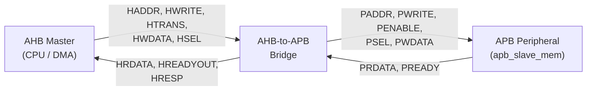
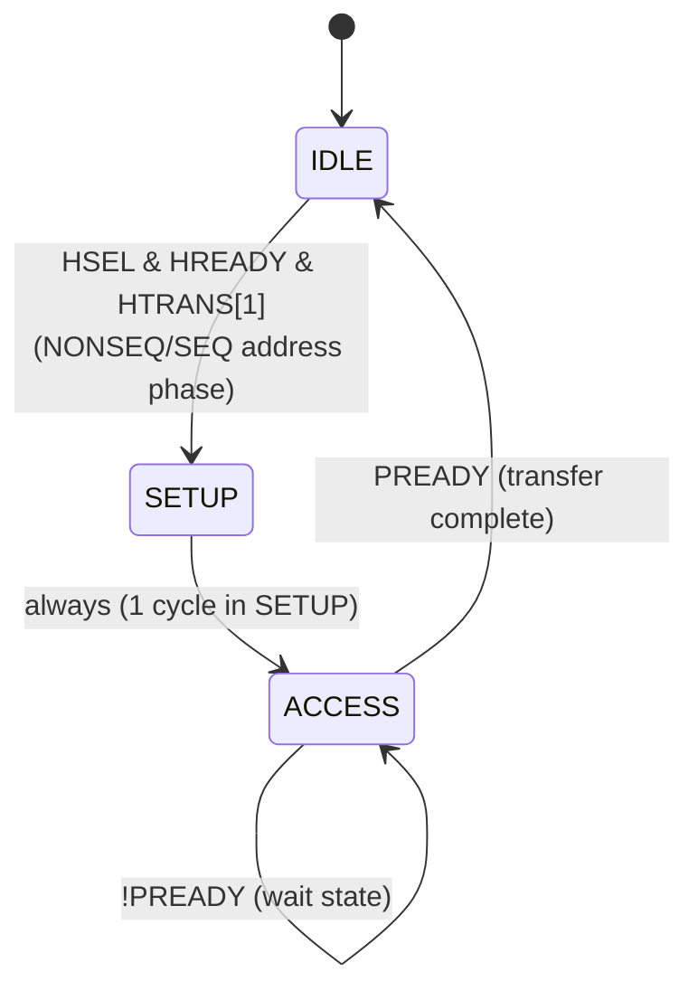
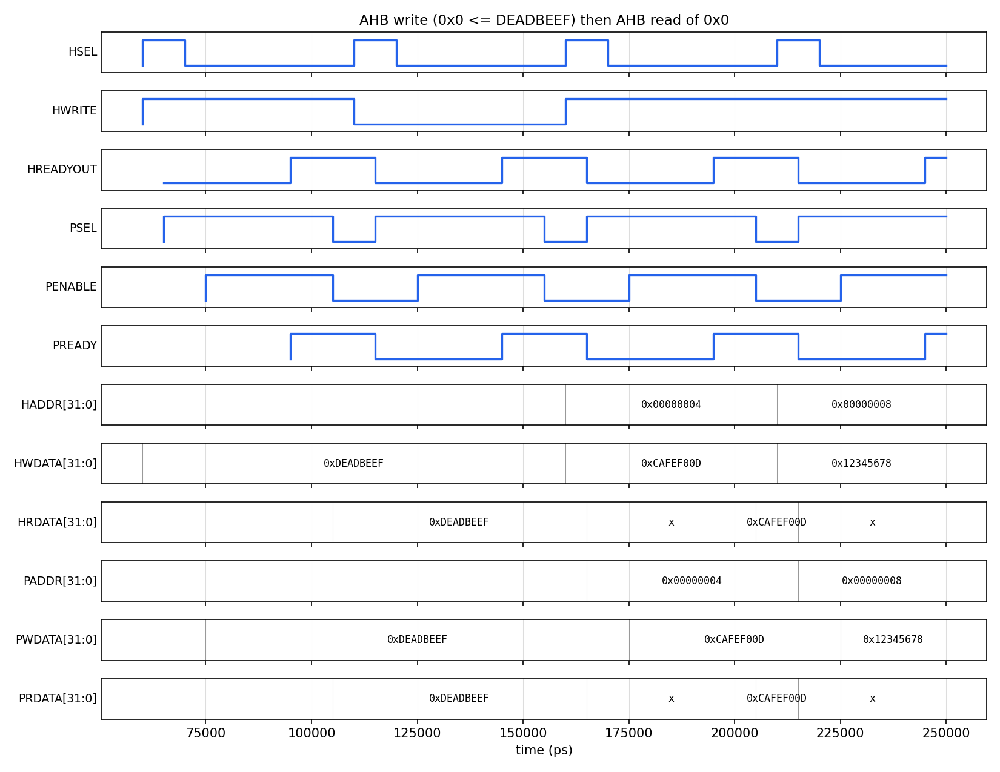

# AHB-to-APB Bridge (AMBA Protocol) in Verilog

A synthesizable AHB-Lite ⇄ APB bridge, written and verified as part of my VLSI Design internship at **Maven Silicon**. It converts single AHB-Lite transfers from a high-performance system bus into the SETUP/ACCESS handshake required by APB peripherals, including support for APB wait states via `PREADY`.

[](https://github.com/steveicarus/iverilog)
[](https://github.com/gtkwave/gtkwave)
[](LICENSE)


Completion Certificate is attached here -- [! Certification](https://img.shields.io/badge/Certification-2E933C)(Certification.pdf)
---

## Table of Contents

- [Overview](#overview)
- [Why a Bridge? AHB vs. APB](#why-a-bridge-ahb-vs-apb)
- [Architecture](#architecture)
- [Signal Reference](#signal-reference)
- [Bridge FSM](#bridge-fsm)
- [Repository Structure](#repository-structure)
- [Getting Started](#getting-started)
- [Verification Plan](#verification-plan)
- [Simulation Results](#simulation-results)
- [Sample Waveform](#sample-waveform)
- [Future Work](#future-work)
- [Key Learnings](#key-learnings)
- [References](#references)
- [License](#license)

---

## Overview

Modern SoCs run a high-bandwidth **AHB** (Advanced High-performance Bus) for the CPU, memory controllers, and DMA, but low-bandwidth peripherals (UART, GPIO, timers, SPI) sit on a simpler, lower-power **APB** (Advanced Peripheral Bus). An **AHB-to-APB bridge** sits at the boundary: it looks like an ordinary AHB slave to the system bus, and like the single APB master to everything behind it.

This repo contains:

- `ahb_apb_bridge` — the bridge RTL (AHB-Lite slave port + APB master port)
- `apb_slave_mem` — a small APB register-file peripheral used only for verification, with an optional injectable wait-state count to exercise `PREADY` stalling
- A self-checking testbench that drives back-to-back AHB writes/reads and checks read-back data automatically

## Why a Bridge? AHB vs. APB

| | AHB (AHB-Lite) | APB |
|---|---|---|
| Purpose | High-performance system bus | Low-power peripheral bus |
| Transfer style | Pipelined (address + data phases overlap) | Non-pipelined, 2–3 phase SETUP/ACCESS |
| Typical masters | CPU, DMA, memory controllers | None — always a bridge |
| Wait states | Via `HREADY` | Via `PREADY` |
| Power / complexity | Higher | Lower — simpler peripheral logic |

Because the two protocols have fundamentally different handshakes, a peripheral can't sit directly on the AHB bus without the timing conversion this bridge performs.

## Architecture



The bridge is purely a protocol/timing converter — it holds no memory of its own. It:

1. Accepts one AHB-Lite `NONSEQ` transfer at a time (address phase).
2. Latches `HADDR` / `HWRITE`, and the write data on the following (data-phase) cycle.
3. Drives the equivalent APB `SETUP` → `ACCESS` sequence.
4. Waits for `PREADY` (supports any number of APB wait states).
5. Returns the result to the AHB master via `HRDATA` / `HREADYOUT`, stalling the AHB bus (`HREADYOUT = 0`) for the duration of the APB transfer.

## Signal Reference

**AHB-Lite slave port**

| Signal | Dir | Width | Description |
|---|---|---|---|
| `HCLK` | in | 1 | Bus clock |
| `HRESETn` | in | 1 | Active-low reset |
| `HSEL` | in | 1 | Bridge selected for this transfer |
| `HADDR` | in | 32 | Transfer address |
| `HTRANS` | in | 2 | `00` IDLE · `01` BUSY · `10` NONSEQ · `11` SEQ |
| `HWRITE` | in | 1 | 1 = write, 0 = read |
| `HSIZE` | in | 3 | Transfer size (byte/half/word) |
| `HWDATA` | in | 32 | Write data |
| `HREADY` | in | 1 | Previous slave's ready (bus-level) |
| `HREADYOUT` | out | 1 | This slave's ready (stalls bus when 0) |
| `HRDATA` | out | 32 | Read data |
| `HRESP` | out | 1 | `0` OKAY (error response not implemented) |

**APB master port**

| Signal | Dir | Width | Description |
|---|---|---|---|
| `PSEL` | out | 1 | Peripheral selected |
| `PENABLE` | out | 1 | High during the ACCESS phase only |
| `PADDR` | out | 32 | Peripheral address |
| `PWRITE` | out | 1 | 1 = write, 0 = read |
| `PWDATA` | out | 32 | Write data |
| `PRDATA` | in | 32 | Read data (combinational from the peripheral) |
| `PREADY` | in | 1 | Peripheral ready (0 inserts wait states) |

## Bridge FSM



| State | `PSEL` | `PENABLE` | `HREADYOUT` | Notes |
|---|---|---|---|---|
| `IDLE` | 0 | 0 | 1 | Bus free, ready to accept a new address phase |
| `SETUP` | 1 | 0 | 0 | Address driven onto APB; write data latched |
| `ACCESS` | 1 | 1 | `PREADY` | Waits here for as many cycles as the peripheral needs |

## Repository Structure

```
ahb-apb-bridge/
├── rtl/
│   ├── ahb_apb_bridge.v     # Bridge DUT
│   └── apb_slave_mem.v      # APB peripheral used for verification
├── tb/
│   └── tb_ahb_apb_bridge.v  # Self-checking testbench
├── sim/
│   └── Makefile             # iverilog / vvp / gtkwave targets
├── docs/
│   └── waveform_write_read.png
├── LICENSE
└── README.md
```

## Getting Started

**Prerequisites:** [Icarus Verilog]([http://iverilog.icarus.com/]) (`iverilog`, `vvp`) and, optionally, [GTKWave](https://gtkwave.sourceforge.net/) for waveform viewing.

```bash
# Debian/Ubuntu
sudo apt-get install iverilog gtkwave
```

**Run the testbench:**

```bash
cd sim
make run
```

**View waveforms:**

```bash
make wave      # opens ahb_apb_bridge.vcd in GTKWave
```

**Clean build artifacts:**

```bash
make clean
```

## Verification Plan

| # | Test | What it checks |
|---|---|---|
| 1 | Single write + read-back | Basic AHB→APB write, then read, data match |
| 2 | Multiple distinct addresses | Address decode / latching across back-to-back transfers |
| 3 | Overwrite an existing address | Bridge doesn't cache stale data |
| 4 | Back-to-back write, write, read, read | `HREADYOUT` correctly gates the next address phase |
| 5 | APB wait states (`PREADY` low for 2 cycles) | Bridge correctly stalls `HREADYOUT` until `PREADY` |

The testbench is self-checking: each read is compared against the expected value with `===`, and a running PASS/FAIL count is printed, ending in a single summary line.

## Simulation Results

```
[PASS] addr=0x00000000 expected=0xdeadbeef got=0xdeadbeef
[PASS] addr=0x00000004 expected=0xcafef00d got=0xcafef00d
[PASS] addr=0x00000008 expected=0x12345678 got=0x12345678
[PASS] addr=0x0000000c expected=0xa5a55a5a got=0xa5a55a5a
[PASS] addr=0x00000000 expected=0x00000001 got=0x00000001
[PASS] addr=0x00000014 expected=0x22222222 got=0x22222222
[PASS] addr=0x00000010 expected=0x11111111 got=0x11111111
--------------------------------------------------
 AHB-APB Bridge Testbench Summary
   PASS : 7
   FAIL : 0
 RESULT: ALL TESTS PASSED
--------------------------------------------------
```

Verified with a 2-cycle `PREADY` wait-state slave (`WAIT_CYCLES = 2` in `apb_slave_mem`); also passes with `WAIT_CYCLES = 0` (zero-wait-state peripheral).

## Sample Waveform



*A single AHB write of `0xDEADBEEF` to address `0x0`, followed by an AHB read of the same address — `HREADYOUT` drops during `SETUP`/`ACCESS` and the read data appears on `HRDATA` in the same cycle it returns high.*

## Future Work

- **Address decoder** to fan the bridge out to multiple APB peripherals (currently targets one)
- **Burst support** (`HBURST`) with proper AHB pipelining instead of the current single-outstanding-transfer model
- **`PSLVERR`** propagation to AHB `HRESP` for peripheral error responses
- Port the testbench to a **UVM** environment (constrained-random stimulus, functional coverage) as a next verification step
- **Gate-level / STA** pass to characterize the design at target frequency

## Key Learnings

- The trickiest part wasn't the FSM itself -- it was getting the **combinational vs. registered timing right at the AHB/APB boundary**: `HREADYOUT`, `HRDATA`, and the APB peripheral's `PRDATA` all have to settle within the *same* cycle for a zero-latency read, which isn't obvious from the protocol diagrams alone.
- Writing a small **self-checking testbench early** (rather than eyeballing waveforms) caught a same-edge data-capture bug that would have been very easy to miss by inspection.
- Parameterizing the peripheral's wait states (`WAIT_CYCLES`) turned out to be the easiest way to confidently exercise the bridge's stall logic, instead of only ever testing the zero-wait-state case.

## References

- Arm AMBA AHB-Lite Protocol Specification (Arm IHI 0033)
- Arm AMBA APB Protocol Specification (Arm IHI 0024)
- Maven Silicon VLSI Design Internship curriculum

## License

Released under the [MIT License](LICENSE).

---

**Author:** Parth Batra · [LinkedIn](https://linkedin.com/in/myself-parthbatra)
